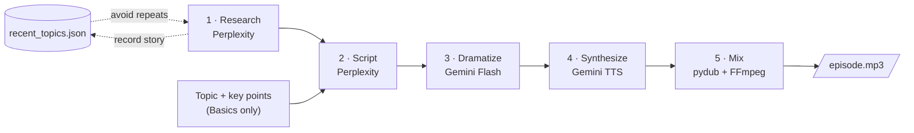

# AI Podcast Generator

An end-to-end pipeline that produces a Spanish-language podcast about artificial intelligence, from finding the news to exporting the final mixed MP3, with no human in the loop.

Each episode is a conversation between two AI-voiced characters: **Tony**, the curious host, and **Gabriela**, the calm expert. The pipeline researches recent stories, writes the dialogue, rewrites it to sound like natural speech, synthesizes both voices, and mixes them with an intro, an outro and background music.

## Context

This project was built within **InnovAI UC3M**, an association at Universidad Carlos III de Madrid, to explore how far a fully automated generative-AI workflow can go in producing a listenable podcast episode.

## Episode formats

| Format | What it covers | Content source | Command |
|---|---|---|---|
| **Deep Dive** | One recent, high-impact AI story, discussed in depth | Perplexity search | `python -m src.run_deep_dive` |
| **Newsletter** | A fast-paced bulletin of five AI stories from the last week | Perplexity search | `python -m src.run_newsletter` |
| **Basics** | An educational explainer on a chosen topic | Topic and key points from the config file or the API | `python -m src.run_basics` |

Episodes run 5–7 minutes and are in European Spanish.

## Architecture



1. **Research** (`news_finder.py`): asks Perplexity for recent AI news, passing the stories already covered so it doesn't repeat them. Skipped in Basics.
2. **Script** (`script_generator.py`): turns the research into a dialogue. The model writes plain lines labelled `Voz A:` / `Voz B:` instead of JSON, which gives more natural dialogue; the labels are parsed back into structured turns afterwards.
3. **Dramatize** (`dramatizer.py`): a second LLM pass adds fillers, pauses and short listener reactions ("ajá", "claro") so the text sounds spoken rather than written. If this step fails, the pipeline continues with the undramatized script.
4. **Synthesize** (`audio_generator.py`): sends the whole conversation to Gemini's multi-speaker TTS in a **single request**, so pacing and intonation stay consistent across turns.
5. **Mix** (`audio_generator.py`): concatenates intro, voices and outro, and lays them over a looped background track with fades.

The only state kept between runs is `data/recent_topics.json`, the record of stories already covered.

## Tech stack

| Area | Technology |
|---|---|
| Language | Python 3.10+ |
| News research and scriptwriting | [Perplexity API](https://docs.perplexity.ai/) (`sonar-pro`) |
| Dialogue dramatization | Google Gemini (`gemini-3-flash-preview`) via [`google-genai`](https://pypi.org/project/google-genai/) |
| Text-to-speech | Google Gemini multi-speaker TTS (`gemini-2.5-pro-preview-tts`) |
| Audio post-production | [pydub](https://github.com/jiaaro/pydub) + [FFmpeg](https://ffmpeg.org/) |
| REST API | [FastAPI](https://fastapi.tiangolo.com/) + Uvicorn |
| Episode storage and job tracking | [Supabase](https://supabase.com/) (Postgres + Storage) |

## Getting started

### 1. Prerequisites

- **Python 3.10 or newer.**
- **FFmpeg** on your `PATH`. pydub needs it to read and write MP3, and the mixing step fails without it.
  - macOS: `brew install ffmpeg`
  - Ubuntu/Debian: `sudo apt install ffmpeg`
  - Windows: `winget install ffmpeg`
- API keys for **Google AI Studio** and **Perplexity**. **Supabase** is only needed for the REST API.

### 2. Install

```bash
git clone https://github.com/EstrellaTP/Podcast_AI.git
cd Podcast_AI

python -m venv .venv
source .venv/bin/activate        # Windows: .venv\Scripts\activate

pip install -r requirements.txt
```

### 3. Configure

Copy the example file and fill in your own credentials:

```bash
cp .env.example .env
```

| Variable | Required for | Description |
|---|---|---|
| `GOOGLE_API_KEY` | All pipelines | Google AI Studio key, used for dramatization and TTS. [Get one](https://aistudio.google.com/apikey). |
| `PERPLEXITY_API_KEY` | All pipelines | Used for news research and scriptwriting. [Get one](https://www.perplexity.ai/settings/api). |
| `API_AUTH_TOKEN` | REST API | Shared secret clients must send in the `x-token` header. Generate one with `python -c "import secrets; print(secrets.token_urlsafe(32))"`. |
| `SUPABASE_URL` | REST API | Your Supabase project URL. |
| `SUPABASE_KEY` | REST API | Your Supabase API key. |

`.env` is git-ignored. Never commit real credentials.

Prompts, the Perplexity model and the default Basics episode are in [`config/podcast_config.json`](config/podcast_config.json).

## Usage

Run every command from the repository root.

### From the command line

```bash
python -m src.run_deep_dive     # one story, in depth
python -m src.run_newsletter    # five stories, bulletin style
python -m src.run_basics        # educational episode from config/podcast_config.json
```

Each run writes its files to `output/YYYY_MM_DD/`:

| File | Contents |
|---|---|
| `ai_news_summary_*.json` / `newsletter_summary_*.json` | Research results, including the raw API response |
| `podcast_script_*.txt` | Script as generated |
| `podcast_script_*_dramatized.txt` | Script after the dramatization pass |
| `podcast_raw.wav` | Unmixed voice track, kept so the mix can be redone without paying for synthesis again |
| `podcast_final*.mp3` | **The finished episode** |

To make today's stories available again after a failed or discarded run:

```bash
python -m src.cleanup
```

### Through the REST API

The API generates a **Basics** episode on demand, uploads the MP3 to Supabase Storage and records the job in the database.

**Supabase setup.** The API expects:

- A storage bucket named `podcast`, with public read access so the returned URL can be played directly.
- A table named `podcasts_history` with the columns `id` (auto-generated primary key), `tema` (text), `estado` (text) and `audio_url` (text).

Start the server:

```bash
uvicorn src.api:app --reload
```

Then request an episode:

```bash
curl -X POST "http://localhost:8000/produce" \
     -H "x-token: $API_AUTH_TOKEN" \
     -H "Content-Type: application/json" \
     -d '{
           "tema": "¿Mi título vale algo? El mercado laboral en la era de la IA",
           "puntos": [
             "La IA no te quitará el trabajo, te lo quitará alguien que use IA.",
             "Habilidades a prueba de robots."
           ]
         }'
```

A successful response:

```json
{
  "status": "success",
  "message": "Podcast generated and uploaded to the cloud",
  "audio_url": "https://<project>.supabase.co/storage/v1/object/public/podcast/episodios/..."
}
```

The request body uses Spanish field names (`tema`, `puntos`) for compatibility with existing clients. Interactive docs are available at `http://localhost:8000/docs` while the server is running.

## Project structure

```
Podcast_AI/
├── assets/                  # Intro, outro and background music for the mix
├── config/
│   └── podcast_config.json  # Prompts, Perplexity model, default Basics episode
├── data/                    # recent_topics.json is created here on the first run
├── output/                  # Generated episodes, one folder per day (git-ignored)
├── src/
│   ├── config.py            # Loads .env once; paths and credential checks
│   ├── news_finder.py       # Stage 1: research with Perplexity
│   ├── script_generator.py  # Stage 2: dialogue writing, script file format
│   ├── dramatizer.py        # Stage 3: natural-speech rewrite with Gemini
│   ├── audio_generator.py   # Stages 4-5: TTS and mixing
│   ├── run_deep_dive.py     # Deep Dive pipeline
│   ├── run_newsletter.py    # Newsletter pipeline
│   ├── run_basics.py        # Basics pipeline
│   ├── api.py               # FastAPI server (POST /produce)
│   └── cleanup.py           # Clears today's entries from the topic history
├── .env.example             # Template for the required environment variables
└── requirements.txt
```

## Limitations

- **Every episode calls paid APIs.** A single run makes three to four requests to Perplexity and Gemini, including a long TTS generation.
- **The API is synchronous.** `POST /produce` responds only when the episode is finished, which can take several minutes. Set generous client and proxy timeouts, or move generation to a background job before exposing the API publicly.
- **Preview models.** Dramatization and TTS use Gemini preview models, which Google can change or retire. The model names are constants at the top of `dramatizer.py` and `audio_generator.py`.
- **Background music licensing.** Before you reuse or redistribute the files in `assets/`, check that you have the rights to them.
